# 技术实现

## Protocol

### gRPC

DiscoveryX 使用 gRPC 作为内部及开放API的数据通信协议，Akka gRPC提供了 gRPC/Protobuf 与 Akka 的集成。

Naming服务可通过gRPC服务描述语言进行定义，Akka gRPC将生成相应的Scala/Java代码及服务接口。

@@snip [discoveryx.proto](../../../../../discoveryx-common/src/main/protobuf/fusion/discoveryx/grpc/discoveryx.proto) { #NamingService }

### Protobuf

DiscoveryX 使用 Protobuf 来定义和序列化数据消息，服务需要的请求参数、响应结果通过Protobuf定义，它将被自动编译并生成相应的case class。

@@snip [model](../../../../../discoveryx-common/src/main/protobuf/fusion/discoveryx/model/discoveryx.proto) { #Instance }

### gRPC PowerApi

Akka gRPC在生成服务时有两种选择：

1. 配置服务，生成的Scala/Java服务签名与 gRPC 定义一一对应
2. PowerApi，生成的Scala/Java服务多带一个`metadata`参数，可在定义的数据请求这外使用HTTP Header。这很有用，意味着通常使用的基于 Cookie 和 HTTP Header 的用户认证、Trace等技术可继续使用。

对于 `heartbeat` 这个服务，它的服务端实现如下：

```scala
  override def heartbeat(
      in: Source[InstanceHeartbeat, NotUsed],
      metadata: Metadata): Source[ServerStatusBO, NotUsed] = {
    try {
      val namespace = metadata
        .getText(Headers.NAMESPACE)
        .getOrElse(throw HSBadRequestException(s"Request header missing, need '${Headers.NAMESPACE}'."))
      // ....
      // ....
      in.map { _ =>
        namingRegion ! ShardingEnvelope(entityId, Heartbeat(namespace, serviceName, instanceId))
        ServerStatusBO(IntStatus.OK)
      }
    } catch {
      case e: Exception =>
        logger.warn(s"Receive heartbeat message error: $e")
        Source.single(ServerStatusBO(IntStatus.BAD_REQUEST))
    }
  }
```

对于服务心跳保持这个服务，gRPC 的 stream 特性可实现全双工通信。一旦请求建立连接，我们不需要在每个心跳请求里都重复包含`namespace`、`serviceName`、`ip`和`port`字段，只需要在第一次请求时发送即可，之后的每次心跳只需要发送一个空请求即可。客户端调用代码使用 `StreamResponseRequestBuilder` 将参数通过HTTP Header传入。

```scala
  def heartbeat(in: Source[InstanceHeartbeat, NotUsed], inst: Instance): Source[ServerStatusBO, NotUsed] = {
    namingClient
      .heartbeat()
      .addHeader(Headers.NAMESPACE, inst.namespace)
      .addHeader(Headers.SERVICE_NAME, inst.serviceName)
      .addHeader(Headers.IP, inst.ip)
      .addHeader(Headers.PORT, Integer.toString(inst.port))
      .addHeader(Headers.INSTANCE_ID, inst.instanceId)
      .invoke(in)
  }
```

## Akka HTTP

### 通过 Akka HTTP 发布 gRPC 服务

gRPC当前是基于HTTP 2的，Akka HTTP也支持HTTP 2，我们可以通过 Akka HTTP 来发布 gRPC 服务。通过 `[ServiceName]Handler` 提供的方法来构造 gRPC handler，有两种方式：

1. `apply`，返回一个函数，签名：`HttpRequest => Future[HttpResponse]`
2. `partial`，返回一个偏函数，签名：`PartialFunction[HttpRequest, Future[HttpResponse]]`

```scala
val managementService = new ManagementServiceImpl()
val handler: HttpRequest => Future[HttpResponse] = ManagementServiceHandler(managementService)
val grpcHandler: PartialFunction[HttpRequest, Future[HttpResponse]] = ManagementServiceHandler.partial(managementService)
```

连接多个 gRPC handler：

```scala
ServiceHandler.concatOrNotFound(grpcHandlers: _*)
```

@@@note
始终使用 `.partial` 构造单个 gRPC 服务 handler，再用 `ServiceHandler.concatOrNotFound()` 合并起来
@@@

### 给 gRPC 服务提供 REST API

#### Directive 指令

Akka HTTP 提供了 Directive（指令）DSL来构造 HTTP API 路由。

```scala
  import fusion.discoveryx.server.util.ProtobufJsonSupport._

  def openRoute: Route = pathPrefix("config") {
    pathPost("GetConfig") {
      entity(as[ConfigGet]) { in =>
        complete(configService.getConfig(in))
      }
    } ~
    pathPost("PublishConfig") {
      entity(as[ConfigItem]) { in =>
        complete(configService.publishConfig(in))
      }
    } ~
    pathPost("RemoveConfig") {
      entity(as[ConfigRemove]) { in =>
        complete(configService.removeConfig(in))
      }
    }
  }
```

Directive 可以组合

```scala
def pathPost[L](pm: PathMatcher[L]): Directive[L] = path(pm) & post
```

#### Marshal/Unmarshal

Marshal/Unmarshal 实现类与 HTTP entity 自动转换，这里 

```scala
  private val jsonStringUnmarshaller =
    Unmarshaller.byteStringUnmarshaller.forContentTypes(unmarshallerContentTypes: _*).mapWithCharset {
      case (ByteString.empty, _) => throw Unmarshaller.NoContentException
      case (data, charset)       => data.decodeString(charset.nioCharset.name)
    }

  private val jsonStringMarshaller =
    Marshaller.oneOf(mediaTypes: _*)(Marshaller.stringMarshaller)

  // HTTP entity => `A`
  implicit def unmarshaller[A <: GeneratedMessage with Message[A]: GeneratedMessageCompanion](
      implicit parser: Parser = ProtobufJson4s.parser): FromEntityUnmarshaller[A] =
    jsonStringUnmarshaller.map(s => parser.fromJsonString(s)).recover(throwCause)

  // `A` => HTTP entity
  implicit def marshaller[A <: GeneratedMessage](
      implicit printer: Printer = ProtobufJson4s.printer,
      shouldWritePretty: ShouldWritePretty = ShouldWritePretty.False): ToEntityMarshaller[A] =
    shouldWritePretty match {
      case ShouldWritePretty.False => jsonStringMarshaller.compose(a => JsonMethods.compact(printer.toJson(a)))
      case ShouldWritePretty.True  => jsonStringMarshaller.compose(a => JsonMethods.pretty(printer.toJson(a)))
    }
```

## Actor

### Protobuf与Typed Actor

@@snip [NamingManagerCommand](../../../../../discoveryx-server/src/main/protobuf/fusion/discoveryx/server/protocol/naming.proto) { #NamingManagerCommand }

`option (scalapb.message).extends = `使消息符合 Typed Actor 的消息类型限制。

`ActorRefCompaion` 提供了`reply_to`字段从 `String` 到 `ActorRef[NamingResponse]` 的相互转换功能。

```scala
trait ActorRefCompanion {
  private def resolver: ActorRefResolver = ActorRefResolver(ActorSystemUtils.system)

  implicit def actorRefTypeMapper[T]: TypeMapper[String, ActorRef[T]] = {
    TypeMapper[String, ActorRef[T]] { str =>
      if (StringUtils.isBlank(str)) ActorSystemUtils.system.deadLetters[T]
      else resolver.resolveActorRef[T](str)
    } { ref =>
      ref.path.elements match {
        case List("deadLetters") => "" // resolver.toSerializationFormat(ActorSystemUtils.system.deadLetters[T])
        case _                   => resolver.toSerializationFormat(ref)
      }
    }
  }
}
```

@@@note
多个 gRPC 服务消息通过 `oneof` 特性合并到一个 protobuf 消息里，这样通常有两个好处：

1. 减少需要通过 `option (scalapb.message).extends ` 定义 protobuf 消息扩展某个接口的次数
2. 这样可以减少需要通过 `[(scalapb.field).type]` 自定义 `ActorRef[T]` 转换的次数。
@@@

@@snip [NamingManagerCommand](../../../../../discoveryx-server/src/main/protobuf/fusion/discoveryx/server/protocol/naming.proto) { #NamingResponse }

`NamingResponse` 作为 `reply_to` 里 `ActorRef[T]` 的类型参数，统一了 Actor 的响应。

1. 因为 Actor 之间的异步特性，消息需要有状态码来表示处理是否成功？（`status`、`message`）字段
0. 通过`oneof`封装实际的业务数据
0. 通过包装，也更加符合通常REST风格API在响应结果时的风格。

@@@note
Protobuf的`oneof`特性在序列化为JSON时，将没有外层的`data`。而是会将具体的消息类型字段返回。如：
```json
{
  "listedService": {
    "serviceInfos": [],
    "page": 1
  }
}
```
@@@

### Typed Actor

**建议**

- object（伴身对象）： 内定义消息类型`trait`、`EntityTypeKey`、消息等
- class（同名类）： 定义具体的`Behavior`，若Actor比较简单，也可以在 `object.apply` 方法里直接实现。
- 响应消息里标注操作是否成功
- 因为 Actor 是异步的，当`ask`超时时异常不应被吞掉，应将异常转换并构造成消息返回

```scala
val response = try {
  // ...
} catch {
  case e => NamingResponse(IntStatus.INTERNAL_ERROR, e.getMessage)
}
replyTo ! response

////////////////////////////////////////////////////////////////////////////////

processCreate(in).recover {
  case e => NamingResponse(IntStatus.INTERNAL_ERROR, e.getMessage)
}.foreach(response => replyTo ! response)
```

## Cluster



### Sharding

通过分片可横向扩展服务Actor（NamingManager、ServiceInstance、ConfigEntity、ConfigManager），一个`entityId`将保证同一时间内整个集群中只有一个实例，同时由集群选择在哪一个节点创建这个实例。

- 具备横向扩展能力
- 地址透明，不需要关心节点、网络地址等，通过 `entityId` 构造 `ShardingEnvelope` 发送消息即可

#### ShardingEnvelope

向分片 Actor 发送消息的载体。NamingManager 可以保存它所能管理的所有 ServiceInstance 的 `entityId`（'[namespace] [serviceName]'）。

不需要保存 ServiceInstance 的 Actor 引用，通过 `ShardingEnvelope` 和 `entityId` 即可向 ServiceInstance 发送消息。

@@@note { title=应用场景 }
ServiceInstance向ServiceManager注册自己
@@@

### Singleton

Primary/Secondary 模式下用来实现 Primary 了。

`Management`（管理Actor）作为一个Singleton。

1. 通过 Singleton Actor 来实现管理功能，保存所有有效的 namespace 列表
2. 通过 `ReadJournal` 查询、监听 **Event** ，管理 `NamingManager` 保存的 `serviceNames` 列表 和 `ConfigManager` 保存的 `configKeys` 列表

### DistributeData

通过 DistributeData 在每个节点同步 namespace 列表，Config、Naming 相关功能校验 namespace 是否有效时实现本地校验（不需要通过网络请求）

## Persistence

数据持久化

### EventSourceBehavior

```
Command -> Event -> State
```

通过处理 `Command` 生成 `Event`，`Event` 将用于改变保存的 `State` （内存中），而每一个 `Event` 将被持久化。恢复时可通过重放 `Event` 来恢复 `State`。

- PersistenceId: 使用 EntityTypeKey.name 和 entityId 一起，保证持久化ID的唯一性
- 恢复时会自动重放所有持久事件

EventSourceBehavior 可以与普通的 Behavior 集成

- 与 ClusterSharding 集成，保证每个 PersistenceId 在整个集群内同一时间只会有一个实例
- 与 ClusterSingleton 集成，保证当前 PersistenceId 在整个集群内同一时间只有一个实例（`Management`）

### 存储的选择

- JDBC：开发环境搭建方便，但性能略差
- Cassandra：性能好，开发环境稍麻烦

*通过 Docker 来自动化创建开发环境*

### Snapshot

通过创建快照可以加快恢复时的速度。

快照被触发时将保存当前 `State`。恢复时将以被保存的 `State` 来初始化状态，同时将快照后的事件进行重放，以将持久化Actor恢复到其当前（既最新）的状态。

### ReadJournal

CQRS架构的查询取端（也称“读取端”）。

写、读的分离。监听 Event 事件，更新ConfigManager保存的dataId列表

@@@note { title=建议 }
应通过 ReadJournal 将事件数据整合后迁移到查询端数据库（比如：Elasticsearch、RDBMS……），由另一个系统来提供更丰富的查询功能。
@@@
